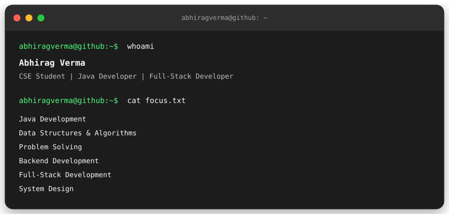

# 👋 Hey, I'm Abhirag Verma

<p align="center">
  
</p>


---

## 🧑‍💻 About Me

I'm a Computer Science Engineering student who enjoys turning ideas into working software.

My current focus is **Java, Data Structures & Algorithms, backend development, and full-stack web development**.

I'm currently exploring:

- ☕ Java & Data Structures
- 🌐 Full-Stack Web Development
- ⚛️ React
- 🟨 JavaScript & TypeScript
- 🟢 Node.js & Express
- 🗄️ MongoDB & MySQL
- 🐍 Python
- ⚙️ C / C++
- 🐧 Linux
- 🧠 Problem Solving & Software Engineering

> I learn best by building projects instead of only following tutorials.

---

# 🛠️ Tech Stack

## 💻 Programming Languages

<p align="left">
  
</p>

---

## 🌐 Frontend Development

<p align="left">
  
</p>

---

## ⚙️ Backend & APIs

<p align="left">
  
</p>

---

## 🤖 AI / Machine Learning & Data Analysis

<p align="left">
  
</p>

> Exploring machine learning, data analysis, and Python-based AI development.

---

## 🗄️ Databases

<p align="left">
  
</p>

---

## 🔧 Tools & Platforms

<p align="left">
  
</p>

---

# 🚀 Featured Projects

## 🏆 SIH2026

A team project developed for the **Smart India Hackathon 2026**.

The project focuses on building a practical solution to a real-world problem while working with a larger application architecture.

**Technologies:**

`TypeScript` · `React` · `Node.js` · `APIs`

🔗 **[View Repository](https://github.com/AbhiragVerma/SIH2026)**

---

## 🗺️ SkillMap

A web application focused on helping users navigate their learning and career journey.

Worked on:

- Frontend development
- React UI
- Tailwind CSS
- Backend integration
- REST APIs
- Deployment
- Git & GitHub collaboration

**Technologies:**

`JavaScript` · `React` · `Tailwind CSS` · `Node.js`

🔗 **[View Repository](https://github.com/AbhiragVerma/skill-map-project)**

---

## 🔐 Auth-Forge

An authentication-focused backend project built to understand how modern applications handle authentication and authorization.

**Technologies:**

`JavaScript` · `Node.js` · `Express.js`

🔗 **[View Repository](https://github.com/AbhiragVerma/Auth-Forge)**

---

## 🏰 The Greatest Estate Developer — Excavillary Engineer

A choice-driven engineering and kingdom-management game inspired by **The Greatest Estate Developer**.

Instead of focusing primarily on combat, the game focuses on engineering, strategy, management, diplomacy, and decision-making.

### Features

- 🌉 Infrastructure development
- 🌊 Flood and disaster management
- 💰 Resource & economy management
- 🤝 Diplomacy and relationships
- 🧠 Strategic decision making
- 📖 Branching storylines
- 🎭 Multiple endings
- 🎒 Player statistics and inventory
- ⭐ Reputation and relationship systems

**Technologies:**

`C` · `C++`

🔗 **[View Repository](https://github.com/AbhiragVerma/The_Greatest_Estate_Developer_Excavillary_Engineer)**

---

# 📚 Learning & Practice

## ☕ Java & Data Structures

I'm actively using Java to strengthen my programming fundamentals and problem-solving skills.

Topics include:

- Object-Oriented Programming
- Data Structures
- Algorithms
- Problem Solving
- Java fundamentals

🔗 **[Java Learning](https://github.com/AbhiragVerma/Java_Learning)**

🔗 **[Java & Data Structures Algorithms](https://github.com/AbhiragVerma/Java_and_Data_Structure_Algorithims)**

---

## 🐍 Python

Programming exercises and small projects created while learning Python.

🔗 **[Employee Management](https://github.com/AbhiragVerma/Employee_Mangment)**

---

## 🌐 JavaScript

Experiments, exercises, and projects created while learning modern JavaScript.

🔗 **[JavaScript](https://github.com/AbhiragVerma/javascript)**

---

# 📈 My Development Journey

```text
HTML / CSS
      ↓
JavaScript
      ↓
React + Tailwind
      ↓
Node.js + Express
      ↓
MongoDB + APIs
      ↓
Full-Stack Projects
      ↓
TypeScript
      ↓
Java + Data Structures
      ↓
Hackathons & Larger Projects
      ↓
Production-Level Development
```
## 🌱 What I'm Looking For

I'm interested in:

* 🤝 Collaborating on interesting projects
* 🏆 Hackathons
* 🌐 Open-source contributions
* 💻 Full-stack development
* 🧠 Learning from experienced developers
* 🚀 Building projects with real-world usefulness

If you're building something interesting, feel free to reach out.

---

## 📫 Find Me

<p align="center">
  <a href="https://github.com/AbhiragVerma">GitHub</a> •
  <a href="https://www.linkedin.com/in/abhiragverma/">LinkedIn</a>
</p>

---

<p align="center">
  <sub>Abhirag Verma · Code, curiosity & way too many debugging sessions.</sub>
</p>
